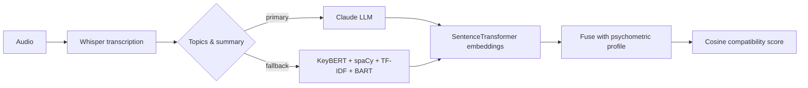

# Psychometric + Topic-Embedding Matcher

**An end-to-end AI/ML service that turns a voice note into a compatibility score: transcribe → understand → embed → match.**


A production-shaped pipeline that takes a user's audio, extracts what they actually talk about, and scores how well two people match by fusing **topic embeddings** with **psychometric profiles**. It is designed to degrade gracefully: if the LLM is unavailable, a classical NLP stack takes over, so the service keeps working.

## What it does
1. **Transcribe** audio with Whisper.
2. **Understand** — extract topics and a summary with Anthropic Claude, with a **fallback** to KeyBERT + spaCy + TF-IDF + BART when the LLM is unavailable.
3. **Embed** topics into vector space with SentenceTransformer.
4. **Fuse** topic embeddings with a user's psychometric profile.
5. **Match** — compute compatibility between users via cosine similarity.

## Architecture


## What it demonstrates
- **End-to-end ML engineering:** audio in, decision out, served behind a FastAPI API.
- **LLM + classical NLP:** an LLM for quality, a deterministic fallback for resilience.
- **Embeddings and vector similarity** applied to a real matching problem.
- **Clean service design:** typed Pydantic models, separated `services/` and `utils/`, config via env.

## Project structure
```
app/
├── main.py               # FastAPI entrypoint
├── config.py             # settings / API keys via env
├── models.py             # Pydantic request/response models
├── services/
│   ├── transcription.py  # Whisper transcription
│   ├── topics.py         # Claude topic extraction + classical fallback
│   ├── vectorize.py      # embeddings + fusion with psychometrics
│   └── match.py          # compatibility scoring
└── utils/io.py           # helpers
sample_data/              # sample audio + synthetic user profiles
```

## Run it
```bash
git clone https://github.com/VikasRaika/voicematch-ai && cd Neom_Ml
python -m venv .venv && source .venv/bin/activate
pip install -r requirements.txt
cp .env.example .env          # add your ANTHROPIC_API_KEY (optional; falls back without it)
uvicorn app.main:app --reload
```
Then POST an audio file to the API and get back topics, a summary, and a compatibility score. Sample audio and synthetic profiles are in `sample_data/`.

## Notes
- The LLM key is optional; without it, the classical NLP fallback runs.
- Synthetic psychometric data is used, no real user data.

## License
MIT © Vikas Raika
